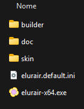
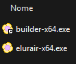
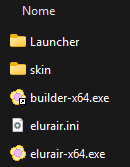
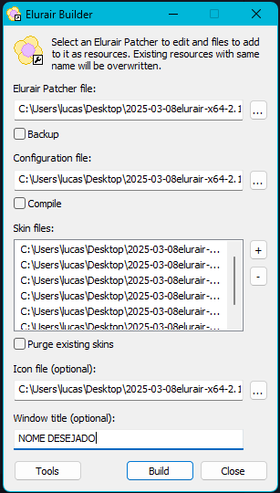
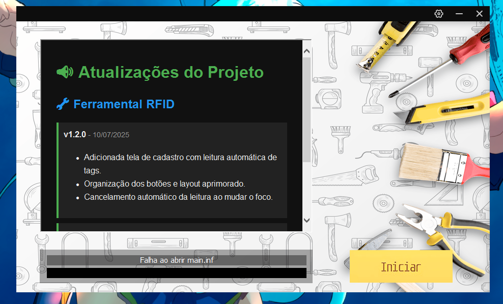
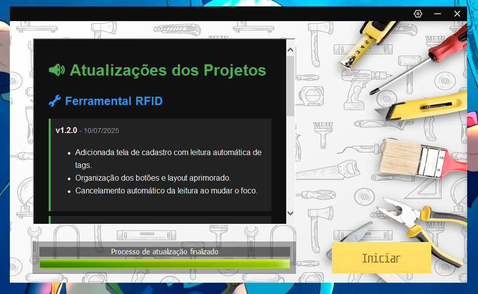

## 📝 Elurair Custom (Changelog)

Nesta pasta, disponibilizo as SKINS que desenvolvi ou que foram compartilhadas gratuitamente pela comunidade para o Launcher Elurair (Free).

📅 Tutorial

## - **Como adicionar uma skin no Elurair**

Após ter baixado o Elurair pelo [REPOSITÓRIO]() ou pelo [SITE OFICIAL](), extraia-o em uma pasta específica para manter a organização. As pastas ficarão conforme o exemplo a seguir:

  

Recomenda-se excluir o arquivo **elurair.default.ini** e as pastas **doc** e **skins**. Já o arquivo **builder-x64.exe**, localizado dentro da pasta **builder**, deve ser movido para a pasta raiz. Essa organização é recomendada para evitar erros. Sua pasta deve ficar assim:

  

Em seguida, extraia a skin. É importante que, ao extrair, a pasta contenha todos os arquivos principais **(por exemplo, Config.ini/elurair.ini, a pasta skins que contém as imagens etc.)** e que não fique tudo dentro de outra subpasta. Se você seguiu os passos recomendados, basta extrair normalmente. Caso contrário, extraia e substitua todos os arquivos, se necessário.

Neste tutorial, será utilizada uma skin básica disponível no repositório, chamada **ferramental_v1**, criada para um projeto de launcher de ferramental RFID. Ao extrair, sua pasta ficará assim. Naturalmente, dependendo do modelo da skin escolhida, a estrutura poderá variar, pois a utilizada neste exemplo é uma skin simples, com poucas pastas e imagens.

  

**LEMBRE-SE**
Antes de realizar este processo, modifique o **elurair.ini** na seção **[ROCred.Patchers.Oficial]** para que seus patchers sejam baixados corretamente. Em caso de dúvidas sobre a configuração, acesse nossa documentação em português (Pt-BR) ou a documentação oficial em inglês.

Após concluir todas as etapas, abra o **builder-x64.exe** para aplicar a skin ao seu launcher.

Em **Elurair Patcher file**: selecione o **elurair-x64.exe** (lembre-se de que na pasta raiz está o **builder-x64.exe**. Caso tenha seguido as recomendações, certifique-se de ter selecionado o **elurair-x64.exe**).

Em **Configuration file**: selecione **elurair.ini** ou **config.ini**.

Em **Skin files**: acesse a pasta da skin e selecione todos os arquivos de imagem disponíveis.

Em **Icon file**: algumas skins disponibilizadas possuem um ícone na pasta da skin. Caso não haja, você pode utilizar qualquer outro ou manter o ícone original.

**Window title**: é o nome que será exibido na janela do Windows. Geralmente, utilizo o nome do programa ou jogo em desenvolvimento.

  

Por fim, clique em **Build** para finalizar o projeto e aplicar a nova skin.

**NOTA** – Caso você realize alterações com frequência, pode ser interessante salvar um modelo em **Tools**.

  

📅 Elurair skins

## - **Elurair skins**

[ferramental_v1.zip]()

  

